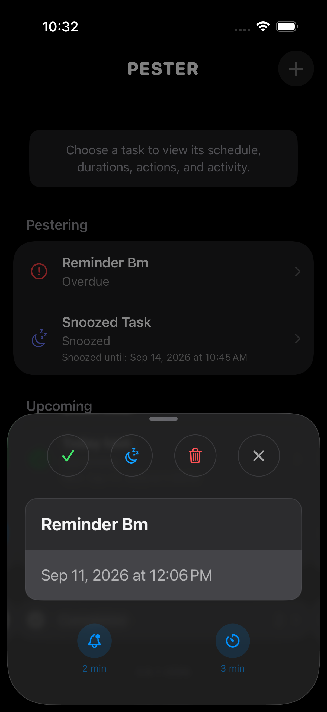

# Pester

> The reminder that keeps coming back—until you complete it or snooze it.

Pester is a focused native iPhone reminder app for things that genuinely need your attention. Schedule a task, choose how often it should pester you, and explicitly complete or snooze it when you are ready.

  
  
  

## What it does

- Creates reminders with a required date and time.
- Repeats local notifications on a configurable interval.
- Keeps lifecycle states clear: Upcoming, Active, Snoozed, Overdue, and Completed.
- Lets you complete or snooze from the app or notification actions.
- Persists reminders locally and preserves their notification schedules across launches.

## Status

Pester is an in-progress native iOS project. The notification foundation, task inbox, editing, snoozing, completion, and local persistence have been validated on a physical iPhone. The current development checkpoint is `0.6.1-0046`; the roadmap documents the next milestones.

## Running locally

1. Open `Pester.xcodeproj` in Xcode.
2. Choose an iPhone simulator or a signed physical iPhone as the run destination.
3. Build and run the `Pester` scheme.
4. Allow notifications when prompted to exercise reminder delivery.

For versioning conventions, see [docs/BUILD.md](docs/BUILD.md). For the milestone history and planned work, see [docs/ROADMAP.md](docs/ROADMAP.md).

## Project focus

Pester is intentionally small. It is not a general productivity system or a Todoist replacement. Its job is to make one promise well: important reminders keep pestering until you take an explicit action.
